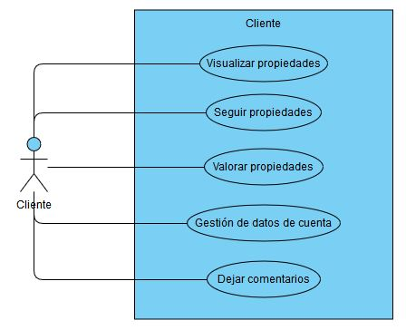
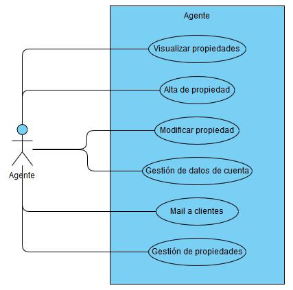
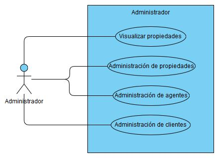
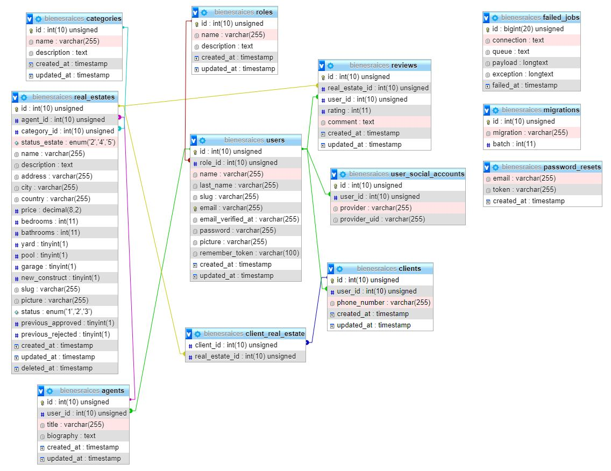

# Proyecto final para FP Desarrollo de Aplicaciones Web

## 1. Introducción

Este proyecto consiste en el desarrollo de una aplicación web destinada a la inmobiliaria “Bienes Raíces” cuyo propósito es presentar las casas y departamentos de lujo que tienen a su disposición para venta y alquiler. La aplicación consta de varias interfaces principales, desarrolladas para cada rol de usuario registrado.

La aplicación se desarrolla en web de forma que los usuarios podrán acceder a ella sin necesidad de realizar instalación de software en su equipo informático, y con el único requisito de tener un navegador web y una conexión a Internet. Estos requisitos a día del desarrollo de esta aplicación, están presentes en todos los hogares y oficinas del país.

## 2. Objetivos

La razón de la elaboración de este proyecto viene a raíz de que una nueva inmobiliaria quiere darse a conocer de manera virtual. Mediante la web se podrá realizar una presentación de las propiedades que gestionan, así como tener un control sobre los clientes interesados en las propiedades y una información sobre los mismos.
Con la introducción de esta aplicación en la empresa se espera llegar a un sector más amplio y a la vez internacional de clientes.

## 3. Tecnologías escogidas y justificación

La aplicación se desarrolla en su mayor parte usando lenguaje de servidor PHP. No obstante, existen partes de la misma realizadas en lenguaje cliente Javascript y la integración de la biblioteca Jquery junto con AJAX.

Cabe mencionar que todo el software utilizado es libre, con lo que la empresa tendrá un considerable ahorro en concepto de licencias. El software seleccionado no lo ha sido sólo por gratuito, sino porque además es una de las tecnologías más utilizada hasta la fecha para desarrollo de aplicaciones web debido a su fiabilidad y a su versatilidad.

Pero lo más importante a destacar es que el lenguaje de programación escogido va asociado al framework utilizado en el desarrollo.

### 3.1. Framework seleccionado

El framework usado durante el desarrollo del proyecto es Laravel v6.17.1. Las razones de su elección son las siguientes:
- Es de código abierto u Open Source. Conlleva una reducción de costos y tiempos en el desarrollo y mantenimiento.
- La documentación existente es sencilla y muy completa, sobretodo en el sitio oficial. Destacar que la comunidad es extremadamente activa y se encuentra en continuo crecimiento.
- Facilita el manejo de routing de la aplicación. También proporciona una generación de url amigables lo que hace más fácil el mantenimiento de un sitio web.
- Cuenta con un sistema de migraciones para gestionar la estructura de la base de datos.
- Gracias al uso de `Eloquent`, un sistema *ORM* muy potente, permite la incorporación fácilmente de paginación automática, relaciones uno-a-uno, uno-a-muchos, muchos-a-muchos, protección de campos, generación de arrays/json, etc.
- Generación de datos de pruebas gracias a la librería `Faker`. El uso de esta poderosa librería ayuda en la carga masiva de datos para la base de datos.
- Nos permite realizar la autenticación en unos sencillos pasos. La utilización de Middlewares hace que la autenticación se vuelva trivial.
- Viene integrado con el Package `Socialite`. Esta utilidad permite registrarse y acceder mediante el uso de *Github*, *Facebook*, *Google*, etc.
- A través de Artisan se puede crear la tabla de usuarios, el validador de autenticación, las rutas para: registro de usuarios, validación de correo electrónico, restauración de contraseña; formularios, contraseñas encriptadas y protección de las rutas.
- Cuenta con un motor de plantillas *`Blade`* para crear el render del HTML final que se le enviará al cliente en respuesta a cada petición. Las plantillas son reutilizables en cada Blade que se crea haciendo uso de de `@extends` para su uso, y `@section` para agregar contenido.

### 3.2. Motor de bases de datos

El motor de base de datos usado es `MySql`. Las razones de su elección son las siguientes:
- Es de adquisición gratuita, lo que permite una reducción de costes para el cliente.
- Es multiplataforma para Windows, Linux y Mac (los sistemas operativos más extendido) con lo cual se podrá disponer de él en cualquier de estos.
- Es un motor muy extendido en la comunidad de desarrolladores, con lo que conseguir ayuda es muy sencillo.
- La labor de mantenimiento de una base de datos MySql es muy fácil debido a que presenta menos funciones frente a otros sistemas gestores. Esto permite que el propio desarrollador sea capaz de llevar a cabo el mantenimiento de la misma sin tener que recurrir a un administrador de base de datos.

### 3.3. Herramientas de desarrollo.

Las herramientas de desarrollo utilizadas son:
- `Visual Studio Code`: editor para el código fuente. Se instalan las extensiones: 
    - `Bootstrap v4 Snippets`
    - `Bracket Pair Colorizer`
    - `Laravel Blade Snippets`
    - `Laravel Snippets`
    - `PHP Debug`
    - `PHP Intelephense`
- `Laragon`: para la creación del entorno de desarrollo de manera local. Permite la configuración de la versión a utilizar de `PHP`, `Apache`, `MySQL` y `Node.js`.

## 4. Diseño de la aplicación

### 4.1. Usuarios y roles

La aplicación dará servicio a cuatro tipos de usuarios:
- `Anónimo`: Solo podrán acceder a la página principal y visualizar la información presentada. Se le requerirá el registro para acceder a otras funcionalidades.
- `Usuario`: Podrán acceder mediante una autenticación a sus datos de carácter personal y podrán interactuar con la misma dependiendo del rol específico
  - `Cliente`: Usuario estándar al registrarse en la aplicación. Podrá realizar una visualización de las propiedades disponibles, así como poder seleccionarlas para mantener un seguimiento sobre ellas. Podrán dejar alguna valoración sobre el propio inmueble y un comentario. Tendrá a su disposición el poder gestionar los datos de la cuenta.
  - `Agente`: Encargado de mantener al día la información de las propiedades, dar de alta a nuevas, modificar sus datos si es necesario, poder ponerse en contacto con los clientes desde la propia aplicación, etc. Todo Agente se considera como Cliente también, por lo tanto podrá realizar las mismas acciones que estos.
  - `Administrador`: Mantendrá un control total sobre la aplicación. Será el responsable de administrar las propiedades, a los clientes y a los agentes.

### 4.2. Casos de uso







### 4.3. Modelo de BD

Modelo generado gracias a `PHPmyadmin`



### 4.4. Creación de tablas

Se adjunta script para la creación de tablas y la inserción de datos actuales en la base de datos

```
Script disponible en la versión PDF.
```

Cabe destacar que gracias a las factories y las migrations la creación de las tablas y la generación de datos se simplifica a ejecutar un solo comando. Este tema se detallará en <insertar punto 5.x>

## 5. Arquitectura de la aplicación

### 5.1. Estructura de carpetas del proyecto

La estructura del proyecto en Laravel se compone de las siguientes carpetas:
- `app/`: usado para ofrecer un hogar por defecto a todo el código de la aplicación. Incluye clases que ofrecen funcionalidad, archivos de configuración y más.
    * `Http/`: uno de los subdirectorios más importantes. En él se ubicarán los controladores, middlewares y requests en sus carpetas correspondientes.
        - `Controllers/`: subdirectorio donde se encontrarán los controladores de la aplicación que se irán creando a medida que avanza el desarrollo.
        - `Middlewares/`: subdirectorio donde se encontrarán los middlewares de la aplicación para la filtración de peticiones HTTP.
        - `Requests/`: subdirectorio donde se ubicarán los archivos para la validación de datos que provengan de peticiones HTTP.
    * `Policies/`: contiene los ficheros de autorización lógica para algún modelo en particular o recurso. EstatePolicy.php autoriza las acciones de los clientes sobre las propiedades.
    * A nivel de raíz, también se encontrarán los modelos:
        - `Agent.php`, `Category.php`, `Cliente.php`, `RealEstate.php`, `Reviews.php`, `Role.php`, `User.php`, `UserSocialAccount.php`.

- `config/`: ubicación de la configuración tanto para el framework como para la aplicación. Los archivos más destacados son:
    - `app.php`: permite la configuración del lenguaje de la aplicación, la zona horaria, los providers y aliases de las clases más comunes.
    - `database.php`: permite la configuración principalmente del motor de base de datos al cuál se conectará la aplicación.

- `database/`: se encuentran los archivos relacionados con el manejo de la base de datos. Los subdirectorios que se encuentran son:
    - `factories/`: se configuran los *model factories*, que permitirán realizar una carga de información falsa en la base de datos.
    - `migrations/`: se almacenan los archivos de migración o configuración de esquema de la base de datos. Se crea un archivo por cada tabla que sea necesaria. Destacar que la creación de tablas se hará mediante la función `up()` y el borrado de éstas con la función `down()`.
    - `seeds/`: se almacenan los archivos que permitirán poblar de información la base de datos.

- `public/`: directorio para la ubicación de todos los recursos estáticos de la aplicación: archivos css, js, imágenes y fuentes.

- `resources/`: dentro de este directorio se encuentran los subdirectorios:
    - `js/`: ubicación de los archivos *.js* para la ejecución de jquery de Bootstrap y de componentes como Vue.js
    - `lang/`: ubicación de los archivos de localización o internacionalización, es decir, los archivos para poder pasar la aplicación de un idioma a otro. Habrá una carpeta por cada idioma. Destacar los archivos:
        - `en.json`: realizará la traducción al inglés de todas las cadenas que se encuentren en la aplicación escritas en con el formato *__{{ “cadena” }}*. Se define cada cadena y la cadena por la cual se sustituirá.
        - `es.json`: realizará la traducción al español de todas las cadenas que se encuentren en la aplicación escritas en con el formato *__{{ “cadena” }}*. Se define cada cadena y la cadena por la cual se sustituirá.
    - `sass/`: ubicación de los archivos *.scss* de la aplicación.
    - `views/`: ubicación de las vistas en formato *.php* o *blade.php*, donde se creará una carpeta para cada controlador.

- `routes/`: contiene todas las definiciones de ruta de la aplicación. Por defecto, se incluyen varios archivos de ruta:
    - `web.php`: contiene las rutas que el *`RouteServiceProvider`* coloca en el grupo de middleware web, proporcionando estado de sesión, protección CSRF y cifrado de cookies.
    - `api.php`: contiene las rutas que el *`RouteServiceProvider`* coloca en el grupo de middleware api, proporcionando limitación de velocidad.
    - `console.php`: es donde se pueden definir todos los comandos de la consola basados en `Closure`.
    - `channels.php`: es donde se pueden registrar todos los canales de transmisión de eventos que admite su aplicación.

- `storage/`: contiene las plantillas *Blade* compiladas, sesiones basadas en archivos, cachés de archivos y otros archivos generados por el framework. Va integrado de los subdirectorios:
    - `app/`: usado para almacenar cualquier archivo generado por la aplicación.
        - `public/`: en él se almacenan archivos generados por el usuario. Es necesario crear un enlace simbólico en *`public/storage`* que apunte a este directorio.
    - `framework/`: se utiliza para almacenar archivos y cachés generados por el framework.
    - `logs/`: contiene los archivos de registro de la aplicación.

- `.env`: en este archivo se configurará el modo en que se ejecuta nuestra aplicación. Además se puede configurar la conexión a la base de datos y la conexión con el servidor de correo electrónico.

### 5.2. Recursos externos

Durante el desarrollo de la aplicación se han usado diversos recursos externos, es decir, librerías y código no escrito por el desarrollador de esta aplicación. Los recursos externos son:
- `Bootstrap`: para el aspecto visual de la aplicación.
- `Font awesome`: iconos para los distintos elementos html.
- `Lorem Pixel`: página para la generación de imágenes automáticas. Usada en la generación de imágenes a través de `Faker`.
- `Jquery`: librería de Javascript.
- `Laravel-Lang`: provee 75 idiomas posibles para Laravel. Esta paquete contiene los archivos de localización para autorización, paginación, contraseñas, validación y socialite.
- `Intervention Image`: paquete que permite el manejo de las imágenes de la aplicación. Usado principalmente para la generación de imágenes en los seeds, pero aplicado a la hora de mostrar las imágenes sin necesidad de mostrar la ruta real.
- `Laravel Debugar`: librería usada durante el desarrollo de la aplicación. Permite la visualización de mensajes, vistas, querys, etc. Que van surgiendo durante el desarrollo. Solo se mostrará si está configurado en el archivo .env.
- `Laravel Socialite`: integración de redes sociales para el acceso a la aplicación. Se han de tener las APPS de inicio de sesión para las redes sociales requeridas.
- `Laravel Datables`: mediante este plug-in de Jquery se permite la generación de tablas sencillas que trabajan con AJAX.
- `Vue.js`: framework progresivo para la construcción de interfaces de usuario.
